# Pine Ridge WebRTC Testing System - Architecture Documentation

## System Architecture Overview

The Pine Ridge WebRTC Testing System is a Claude-Agentic automation framework designed to test WebRTC applications using multi-browser coordination. The system follows a layered architecture with dependency injection and strategy patterns.

## Architecture Diagram

```mermaid
graph TB
    %% Entry Point Layer
    Main[main.py<br/>CLI Entry Point<br/>🚀 System Bootstrap] --> Config[SystemConfig<br/>Environment Setup<br/>⚙️ Configuration Management]
    Main --> Claude[ClaudeAgentController<br/>Core Intelligence<br/>🧠 AI Orchestration]
    Main --> MCP[PuppeteerMCPClient<br/>Browser Automation<br/>🤖 Web Automation Engine]
    Main --> TestRail[TestRailMCPIntegration<br/>External Reporting<br/>📊 Results Integration]
    
    %% Core Intelligence Layer
    Claude --> ExecutionPlan[ExecutionPlan<br/>Dynamic Planning<br/>📋 Adaptive Strategies]
    Claude --> TestResult[TestResult<br/>Result Aggregation<br/>📈 Outcome Analysis]
    Claude --> FallbackStrategies[FallbackStrategies<br/>Error Recovery<br/>🔄 Resilience Logic]
    
    %% Browser Automation Layer
    MCP --> Playwright[Playwright<br/>Browser Engine<br/>🌐 Cross-Platform Automation]
    MCP --> ChromeConfig[Chrome Configuration<br/>WebRTC Publisher Setup<br/>🎤 Audio/Video Publishing]
    MCP --> SafariConfig[Safari Configuration<br/>WebRTC Subscriber Setup<br/>🔊 Audio/Video Receiving]
    
    %% Browser Instances
    Playwright --> ChromeBrowser[Chrome Browser<br/>Publisher Role<br/>📡 Media Transmission]
    Playwright --> SafariBrowser[Safari Browser<br/>Subscriber Role<br/>📻 Media Reception]
    
    %% Pine Ridge Application Layer
    ChromeBrowser --> PineRidge[Pine Ridge Application<br/>WebRTC Platform<br/>🏔️ Real-time Communication]
    SafariBrowser --> PineRidge
    
    %% Automation Actions
    MCP --> JoinChannel[Join Channel<br/>UI Interaction<br/>🏠 Channel Entry]
    MCP --> PublishStream[Publish Stream<br/>Media Publishing<br/>📹 Stream Broadcast]
    MCP --> VerifyConnection[Verify Connection<br/>WebRTC Validation<br/>✅ Connection Health]
    
    %% Utility Layer
    Config --> Logger[Logger<br/>Centralized Logging<br/>📝 Event Tracking]
    Config --> Screenshot[ScreenshotManager<br/>Image Capture<br/>📸 Visual Evidence]
    Config --> Verification[ManualVerificationInterface<br/>Human Verification<br/>👁️ Quality Assurance]
    
    %% External Systems
    TestRail --> TestRailAPI[TestRail API<br/>Test Management<br/>🧪 Test Case Management]
    Claude --> AnthropicAPI[Anthropic API<br/>AI Decision Making<br/>🤖 Intelligent Automation]
    
    %% Data Collection
    MCP --> Screenshots[Screenshot Storage<br/>Evidence Collection<br/>🖼️ Visual Documentation]
    MCP --> ConsoleLogs[Console Logs<br/>Debug Information<br/>🔍 Runtime Diagnostics]
    
    %% Verification Flow
    Verification --> UserInput[User Input<br/>Manual Verification<br/>⌨️ Human Feedback]
    Screenshots --> Verification
    ConsoleLogs --> Verification
    
    %% Results Flow
    TestResult --> TestRail
    Screenshots --> TestRail
    Logger --> LogFiles[Log Files<br/>Execution Traces<br/>📋 Audit Trail]
    
    %% Legacy Components (To Be Removed)
    subgraph Legacy["🚨 Legacy Components (Tech Debt)"]
        BrowserController[BrowserController<br/>Selenium Legacy<br/>❌ Deprecated]
        ChromePublisher[ChromePublisher<br/>Chrome Automation<br/>❌ Unused]
        SafariSubscriber[SafariSubscriber<br/>Safari Automation<br/>❌ Unused]
        TestExecutor[TestExecutor<br/>Test Coordination<br/>❌ Redundant]
    end
    
    %% Styling
    classDef coreLayer fill:#e1f5fe,stroke:#0277bd,stroke-width:3px
    classDef automationLayer fill:#f3e5f5,stroke:#7b1fa2,stroke-width:2px
    classDef utilityLayer fill:#e8f5e8,stroke:#2e7d32,stroke-width:2px
    classDef externalLayer fill:#fff3e0,stroke:#ef6c00,stroke-width:2px
    classDef legacyLayer fill:#ffebee,stroke:#c62828,stroke-width:2px,stroke-dasharray: 5 5
    classDef dataLayer fill:#f9fbe7,stroke:#689f38,stroke-width:2px
    
    class Main,Claude,MCP,TestRail coreLayer
    class Playwright,ChromeBrowser,SafariBrowser,PineRidge,JoinChannel,PublishStream,VerifyConnection automationLayer
    class Config,Logger,Screenshot,Verification utilityLayer
    class TestRailAPI,AnthropicAPI externalLayer
    class Screenshots,ConsoleLogs,LogFiles,UserInput dataLayer
    class BrowserController,ChromePublisher,SafariSubscriber,TestExecutor legacyLayer
```



## Component Analysis

### 1. **Entry Point Layer**
- **main.py**: Single entry point with CLI argument parsing and system bootstrap
- **Role**: System initialization, dependency injection, and execution orchestration

### 2. **Core Intelligence Layer**
- **ClaudeAgentController**: Central orchestrator with adaptive capabilities
- **ExecutionPlan**: Dynamic test execution planning
- **TestResult**: Result aggregation and analysis
- **Role**: AI-driven decision making and test orchestration

### 3. **Browser Automation Layer**
- **PuppeteerMCPClient**: Primary browser automation engine using Playwright
- **Chrome/Safari Configuration**: Browser-specific WebRTC settings
- **Role**: Cross-browser automation and WebRTC interaction

### 4. **Utility Layer**
- **SystemConfig**: Centralized configuration management
- **Logger**: Centralized logging with multiple output formats
- **ScreenshotManager**: Visual evidence collection
- **ManualVerificationInterface**: Human-in-the-loop verification
- **Role**: Supporting services and utilities

### 5. **External Integration Layer**
- **TestRailMCPIntegration**: Test management system integration
- **AnthropicAPI**: AI decision making services
- **Role**: External system connectivity and data exchange

## Technical Debt Analysis

### 🚨 **High Priority Issues**

#### 1. **Dual Browser Automation Stack**
- **Problem**: System has both Playwright (active) and Selenium (legacy) implementations
- **Impact**: Code duplication, maintenance overhead, confusion
- **Solution**: Remove all Selenium-based components (`BrowserController`, `ChromePublisher`, `SafariSubscriber`, `TestExecutor`)
- **Files to Remove**:
  - `src/automation/browser_controller.py`
  - `src/automation/chrome_publisher.py`
  - `src/automation/safari_subscriber.py`
  - `src/automation/test_executor.py`

#### 2. **Incomplete Claude AI Integration**
- **Problem**: Claude API integration is stubbed out with hardcoded execution plans
- **Impact**: No real AI-driven decision making, limited adaptability
- **Solution**: Implement proper Anthropic API integration with dynamic planning
- **Location**: `src/core/claude_agent_controller.py:122` (hardcoded plan)

#### 3. **Configuration Duplication**
- **Problem**: Multiple config classes with overlapping responsibilities
- **Impact**: Inconsistent configuration, potential conflicts
- **Solution**: Consolidate `SystemConfig` and `Config` into single configuration system
- **Files**: `src/config/system_config.py`, `src/utils/config.py`

### ⚠️ **Medium Priority Issues**

#### 4. **Missing Error Recovery**
- **Problem**: Limited fallback strategies implementation
- **Impact**: Poor resilience to failures
- **Solution**: Implement comprehensive retry and fallback mechanisms
- **Location**: `src/core/claude_agent_controller.py:314` (incomplete fallback strategies)

#### 5. **Screenshot Management Confusion**
- **Problem**: Multiple screenshot utilities with different purposes
- **Impact**: Code duplication, inconsistent behavior
- **Solution**: Unify screenshot management into single utility
- **Files**: `src/utils/screenshot.py`, screenshot logic in `PuppeteerMCPClient`

#### 6. **Inconsistent Async/Sync Patterns**
- **Problem**: Mixed synchronous and asynchronous code patterns
- **Impact**: Performance issues, complexity
- **Solution**: Standardize on async/await patterns throughout

### 📝 **Low Priority Issues**

#### 7. **Magic Numbers and Hardcoded Values**
- **Problem**: Hardcoded timeouts, retry counts, and URLs
- **Impact**: Reduced configurability, maintenance difficulty
- **Solution**: Move all constants to configuration system

#### 8. **Incomplete Type Hints**
- **Problem**: Missing type annotations in several modules
- **Impact**: Reduced IDE support, potential runtime errors
- **Solution**: Add comprehensive type hints

## Data Flow Analysis

### 1. **Test Execution Flow**
```
Configuration Loading → Browser Initialization → Test Execution → Results Reporting
```

### 2. **Adaptive Planning Flow**
```
AI Analysis → Dynamic Planning → Step Execution → Verification → Adaptation
```

### 3. **Error Handling Flow**
```
Error Detection → Retry Logic → Fallback Strategies → Final Reporting
```

### 4. **WebRTC Testing Flow**
```
Chrome Publisher Setup → Safari Subscriber Setup → Connection Verification → Manual Verification
```

## Architectural Strengths

1. **Modular Design**: Clear separation of concerns between layers
2. **Extensibility**: Easy to add new browsers or test scenarios
3. **Multi-Browser Support**: Built-in cross-browser testing capabilities
4. **Human-in-the-Loop**: Manual verification for complex scenarios
5. **Comprehensive Logging**: Detailed execution traces and debugging info
6. **AI Integration**: Framework for intelligent test adaptation

## Performance Characteristics

- **Startup Time**: ~10-15 seconds for full system initialization
- **Memory Usage**: ~200-300MB for dual browser setup
- **Network Overhead**: WebRTC streams + API calls to external services
- **Storage Requirements**: Screenshots and logs accumulate over time
- **Scalability**: Single-machine design, not horizontally scalable

## Security Considerations

1. **API Key Management**: Secure storage of Claude and TestRail credentials
2. **Browser Security**: Proper handling of browser permissions and profiles
3. **Screenshot Privacy**: Secure handling of captured images
4. **Log Sanitization**: Remove sensitive information from logs
5. **Network Security**: HTTPS for all external API communications

## Refactoring Roadmap

### Phase 1: Cleanup (Immediate)
1. Remove Selenium stack and unused automation classes
2. Unify configuration management
3. Implement proper error handling patterns
4. Add comprehensive type hints

### Phase 2: Enhancement (Medium-term)
1. Implement real Claude AI integration
2. Add comprehensive retry and fallback mechanisms
3. Optimize performance and resource usage
4. Improve test coverage and integration tests

### Phase 3: Advanced Features (Long-term)
1. Add monitoring and metrics collection
2. Implement caching for frequently accessed data
3. Create plugin system for extensibility
4. Add horizontal scaling capabilities

## Conclusion

The Pine Ridge WebRTC Testing System has a solid architectural foundation with clear separation of concerns and modular design. However, significant technical debt exists in the form of dual automation stacks and incomplete AI integration. The immediate focus should be on cleanup and consolidation, followed by completion of core features and performance optimization.

The system is well-positioned for future enhancements and can serve as a robust foundation for WebRTC testing automation once the technical debt is addressed.