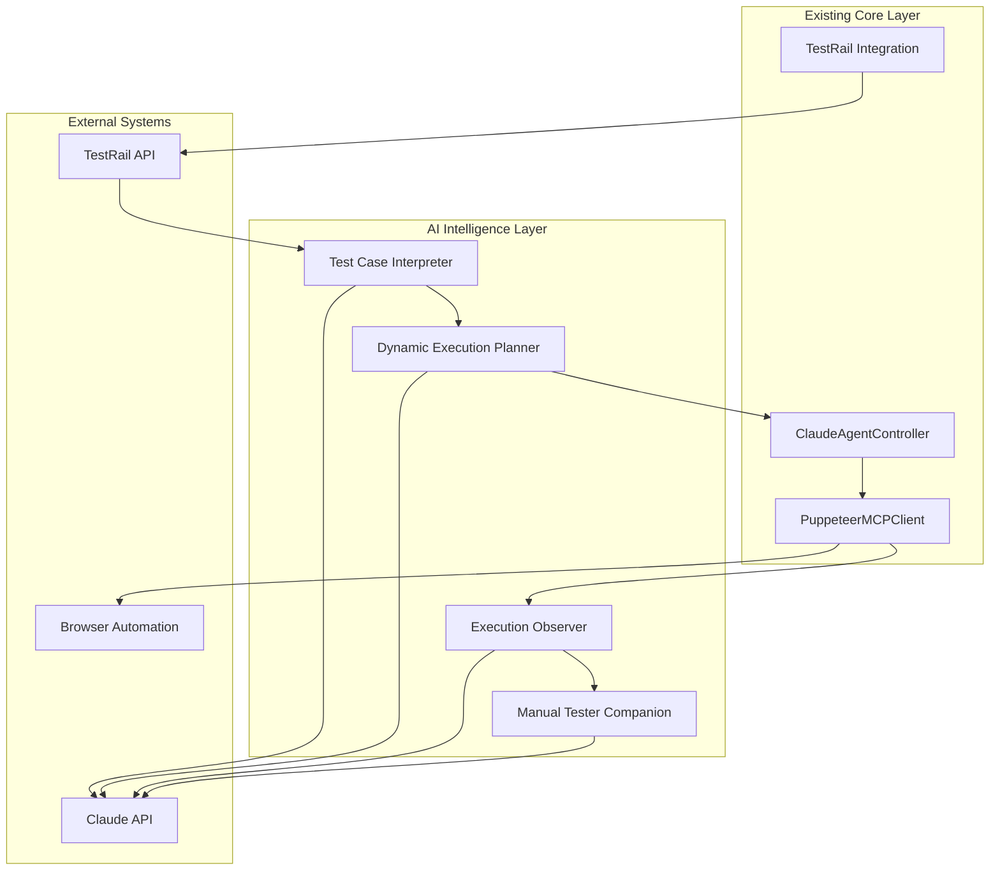

# Claude AI Integration Implementation Plan

## Executive Summary

This document outlines a comprehensive plan for integrating Claude AI capabilities into the Pine Ridge WebRTC Testing System. The AI integration will transform the current hardcoded execution system into an intelligent, adaptive testing framework that serves as both an autonomous test executor and a companion to manual testers.

### Vision Statement
> "Create an AI-powered testing companion that can interpret test cases, generate dynamic execution plans, observe test execution, and provide intelligent debugging support while serving as a collaborative partner to manual testers in regression testing workflows."

### Core Principles
1. **AI as Observer**: Monitor test execution and step in when errors occur
2. **Dynamic Test Interpretation**: Convert TestRail test cases into executable automation steps
3. **Manual Tester Companion**: Enhance rather than replace human testing workflows
4. **Adaptive Execution**: Dynamically adjust test plans based on real-time conditions
5. **Intelligent Debugging**: Provide AI-powered error analysis and recovery suggestions

## Current System Analysis

### Integration Points Identified

#### 1. **ClaudeAgentController** (`src/core/claude_agent_controller.py`)
- **Current State**: Hardcoded execution plans at line 122
- **Integration Point**: Replace `generate_execution_plan()` with AI-powered interpretation
- **Capabilities**: Circuit breaker pattern, fallback strategies, retry mechanisms already implemented

#### 2. **TestRail Integration** (`src/testrail/testrail_mcp_integration.py`)
- **Current State**: Basic API integration for result reporting
- **Integration Point**: Enhance for test case content fetching and interpretation
- **Capabilities**: API authentication, rate limiting, error handling

#### 3. **Browser Automation Engine** (`src/mcp/puppeteer_mcp_client.py`)
- **Current State**: Playwright-based automation with WebRTC support
- **Integration Point**: AI-guided execution with real-time observation
- **Capabilities**: Multi-browser support, permission handling, console log monitoring

#### 4. **Configuration System** (`src/config/system_config.py`)
- **Current State**: Unified configuration management
- **Integration Point**: AI model configuration and prompt management
- **Capabilities**: Environment variable handling, validation, URL generation

### Current Architecture Strengths
- ✅ **Resilient Error Handling**: Circuit breaker pattern implemented
- ✅ **Multi-Browser Support**: Chrome and Safari automation working
- ✅ **Real Device Access**: Actual microphone/camera permissions
- ✅ **Manual Verification**: Human-in-the-loop verification system
- ✅ **Comprehensive Logging**: Console logs and screenshot capture

### Integration Opportunities
- 🔄 **Dynamic Plan Generation**: Replace hardcoded execution steps
- 🔄 **Intelligent Error Recovery**: AI-powered debugging and recovery
- 🔄 **Test Case Interpretation**: Convert TestRail content to automation
- 🔄 **Adaptive Execution**: Real-time plan adjustment based on conditions
- 🔄 **Manual Tester Support**: Workflow integration and assistance

## Claude AI Agent Architecture Design

### 1. **Core AI Components**

#### **A. Test Case Interpreter**
```python
class TestCaseInterpreter:
    """Converts TestRail test cases into structured automation plans"""
    
    async def interpret_test_case(self, test_case_content: str) -> StructuredTestCase
    async def extract_test_requirements(self, test_case: Dict) -> TestRequirements
    async def identify_browsers_and_platforms(self, test_case: Dict) -> List[BrowserConfig]
    async def parse_verification_criteria(self, test_case: Dict) -> VerificationCriteria
```

#### **B. Dynamic Execution Planner**
```python
class DynamicExecutionPlanner:
    """Generates adaptive execution plans based on test case interpretation"""
    
    async def generate_execution_plan(self, structured_test_case: StructuredTestCase) -> ExecutionPlan
    async def adapt_plan_for_platform(self, plan: ExecutionPlan, platform: str) -> ExecutionPlan
    async def create_fallback_strategies(self, plan: ExecutionPlan) -> List[FallbackStrategy]
    async def optimize_execution_order(self, steps: List[ExecutionStep]) -> List[ExecutionStep]
```

#### **C. Execution Observer**
```python
class ExecutionObserver:
    """Monitors test execution and provides real-time analysis"""
    
    async def observe_execution_step(self, step: ExecutionStep, result: Dict) -> ObservationResult
    async def analyze_error_condition(self, error: Exception, context: Dict) -> ErrorAnalysis
    async def suggest_recovery_actions(self, error_analysis: ErrorAnalysis) -> List[RecoveryAction]
    async def detect_ui_changes(self, screenshot: bytes, expected_elements: List[str]) -> List[UIChange]
```

#### **D. Manual Tester Companion**
```python
class ManualTesterCompanion:
    """Provides intelligent assistance to manual testers"""
    
    async def generate_test_session_plan(self, test_cases: List[str]) -> TestSessionPlan
    async def provide_context_aware_guidance(self, current_step: str, browser_state: Dict) -> Guidance
    async def suggest_verification_points(self, test_case: StructuredTestCase) -> List[VerificationPoint]
    async def analyze_regression_patterns(self, historical_results: List[TestResult]) -> RegressionAnalysis
```

### 2. **AI Integration Architecture**



### 3. **Data Flow Architecture**

```
TestRail Test Case → AI Interpreter → Structured Test Case → 
Dynamic Planner → Execution Plan → Browser Automation → 
Execution Observer → Error Analysis → Recovery Suggestions → 
Manual Tester Companion → Enhanced Workflow
```

## Multi-Phase Implementation Plan

### Phase 1: Foundation & Test Case Interpretation (Week 1-2)

#### **Objectives**
- Establish Claude API integration foundation
- Implement basic test case interpretation
- Create structured test case data models

#### **Deliverables**
1. **Claude API Client Implementation**
   ```python
   class ClaudeAPIClient:
       def __init__(self, api_key: str, model: str = "claude-3-sonnet-20240229")
       async def interpret_test_case(self, prompt: str) -> Dict
       async def generate_execution_plan(self, test_case: Dict) -> Dict
       async def analyze_error(self, error_context: Dict) -> Dict
   ```

2. **Test Case Data Models**
   ```python
   @dataclass
   class StructuredTestCase:
       id: str
       title: str
       description: str
       steps: List[TestStep]
       expected_results: List[ExpectedResult]
       browsers: List[BrowserRequirement]
       platform: str
       verification_type: str
       
   @dataclass
   class TestStep:
       id: str
       action: str
       parameters: Dict[str, Any]
       expected_outcome: str
       verification_method: str
   ```

3. **Enhanced TestRail Integration**
   - Fetch full test case content including steps and expected results
   - Parse test case metadata and requirements
   - Extract platform and browser requirements

#### **Success Criteria**
- ✅ Claude API successfully interprets sample test cases
- ✅ Test case content is parsed into structured format
- ✅ Basic execution plan generation works

### Phase 2: Dynamic Execution Plan Generation (Week 3-4)

#### **Objectives**
- Replace hardcoded execution plans with AI-generated ones
- Implement adaptive execution based on test case content
- Create platform-specific execution strategies

#### **Deliverables**
1. **AI-Powered Plan Generation**
   ```python
   async def generate_execution_plan(self, test_case_id: str) -> ExecutionPlan:
       # Fetch test case from TestRail
       test_case = await self.testrail_client.get_test_case(test_case_id)
       
       # Interpret test case content
       structured_case = await self.interpreter.interpret_test_case(test_case)
       
       # Generate dynamic execution plan
       plan = await self.planner.generate_execution_plan(structured_case)
       
       # Add platform-specific adaptations
       adapted_plan = await self.planner.adapt_plan_for_platform(plan, "macos")
       
       return adapted_plan
   ```

2. **Adaptive Execution Strategies**
   - Browser-specific action mapping
   - Platform-specific UI element detection
   - Dynamic timeout and retry configuration

3. **Enhanced Fallback Strategies**
   - AI-generated alternative approaches
   - Context-aware error recovery
   - Learning from previous execution patterns

#### **Success Criteria**
- ✅ Dynamic plans generated for different test case types
- ✅ Platform-specific adaptations working
- ✅ Fallback strategies intelligently selected

### Phase 3: Execution Observation & Error Analysis (Week 5-6)

#### **Objectives**
- Implement real-time execution monitoring
- Create AI-powered error analysis and recovery
- Develop intelligent debugging capabilities

#### **Deliverables**
1. **Real-Time Execution Observer**
   ```python
   async def observe_execution_step(self, step: ExecutionStep, result: Dict) -> ObservationResult:
       # Monitor execution progress
       execution_state = await self.analyze_execution_state(result)
       
       # Compare with expected outcomes
       deviation = await self.detect_deviations(execution_state, step.expected_outcome)
       
       # Generate observations
       observation = ObservationResult(
           step_id=step.id,
           actual_result=execution_state,
           deviation=deviation,
           confidence=self.calculate_confidence(execution_state),
           recommendations=await self.generate_recommendations(deviation)
       )
       
       return observation
   ```

2. **AI-Powered Error Analysis**
   - Screenshot analysis for UI changes
   - Console log pattern recognition
   - Error categorization and root cause analysis

3. **Intelligent Recovery Suggestions**
   - Context-aware recovery actions
   - Alternative execution paths
   - Learning from successful recoveries

#### **Success Criteria**
- ✅ Real-time execution monitoring functional
- ✅ Error analysis provides actionable insights
- ✅ Recovery suggestions improve success rates

### Phase 4: Manual Tester Companion Features (Week 7-8)

#### **Objectives**
- Create intelligent assistance for manual testers
- Implement workflow integration capabilities
- Develop regression testing support

#### **Deliverables**
1. **Test Session Planning**
   ```python
   async def generate_test_session_plan(self, test_cases: List[str]) -> TestSessionPlan:
       # Analyze test case dependencies
       dependencies = await self.analyze_test_dependencies(test_cases)
       
       # Optimize execution order
       optimized_order = await self.optimize_execution_order(test_cases, dependencies)
       
       # Generate session plan
       plan = TestSessionPlan(
           test_cases=optimized_order,
           estimated_duration=self.calculate_duration(optimized_order),
           setup_requirements=await self.identify_setup_requirements(optimized_order),
           verification_points=await self.identify_verification_points(optimized_order)
       )
       
       return plan
   ```

2. **Context-Aware Guidance**
   - Real-time step-by-step guidance
   - Browser state awareness
   - Verification point recommendations

3. **Regression Analysis**
   - Historical pattern recognition
   - Failure prediction
   - Test case prioritization

#### **Success Criteria**
- ✅ Manual testers report improved efficiency
- ✅ Test session planning reduces setup time
- ✅ Regression analysis identifies patterns

### Phase 5: Advanced Features & Optimization (Week 9-10)

#### **Objectives**
- Implement advanced AI capabilities
- Optimize performance and reliability
- Create comprehensive documentation

#### **Deliverables**
1. **Advanced AI Features**
   - Multi-modal analysis (screenshot + log + console)
   - Predictive failure detection
   - Automated test case enhancement suggestions

2. **Performance Optimization**
   - Parallel execution planning
   - Caching of AI responses
   - Optimized prompt engineering

3. **Comprehensive Documentation**
   - AI integration architecture guide
   - Manual tester workflow documentation
   - API reference and examples

#### **Success Criteria**
- ✅ Advanced features demonstrate clear value
- ✅ Performance meets production requirements
- ✅ Documentation enables easy adoption

## Test Case Interpretation Strategy

### 1. **TestRail Content Analysis**

#### **Input Format Analysis**
```
TestRail Test Case Structure:
- Title: "C107928 - Publish Local Stream"
- Description: Detailed test objective
- Steps: Numbered list of actions
- Expected Results: Expected outcomes for each step
- Custom Fields: Browser requirements, platform, test type
```

#### **AI Interpretation Process**
1. **Content Parsing**: Extract structured data from TestRail content
2. **Requirement Analysis**: Identify browser, platform, and feature requirements
3. **Action Mapping**: Convert natural language steps to automation actions
4. **Verification Extraction**: Identify verification points and success criteria

### 2. **Dynamic Step Generation**

#### **Example: C107928 Interpretation**
```python
# Input: TestRail test case content
test_case_content = """
Title: C107928 - Publish Local Stream
Description: Test audio publishing functionality in Pine Ridge
Steps:
1. Navigate to Pine Ridge application
2. Join channel "QAtest"
3. Click "Publish Audio" button
4. Verify audio stream is published
5. Open second browser as subscriber
6. Join same channel
7. Verify audio is received
Expected Result: Audio stream successfully published and received
"""

# AI Interpretation Output:
structured_case = StructuredTestCase(
    id="C107928",
    title="Publish Local Stream",
    browsers=["chrome", "safari"],
    platform="macos",
    steps=[
        TestStep(
            id="setup_publisher",
            action="launch_chrome_publisher",
            parameters={"url": "pine_ridge_url", "channel": "QAtest"}
        ),
        TestStep(
            id="join_channel",
            action="join_pine_ridge_channel",
            parameters={"browser": "chrome", "channel_id": "QAtest"}
        ),
        TestStep(
            id="publish_audio",
            action="publish_audio_stream",
            parameters={"browser": "chrome"}
        ),
        TestStep(
            id="setup_subscriber",
            action="launch_safari_subscriber",
            parameters={"url": "pine_ridge_url", "channel": "QAtest"}
        ),
        TestStep(
            id="verify_audio",
            action="conduct_manual_verification",
            parameters={"verification_type": "audio_playback"}
        )
    ]
)
```

### 3. **Adaptive Execution Logic**

#### **Platform-Specific Adaptations**
```python
async def adapt_plan_for_platform(self, plan: ExecutionPlan, platform: str) -> ExecutionPlan:
    if platform == "macos":
        # macOS-specific adaptations
        plan.browsers = ["chrome", "safari"]  # Use Safari on macOS
        plan.permission_handling = "safari_webkit_permissions"
    elif platform == "windows":
        # Windows-specific adaptations
        plan.browsers = ["chrome", "edge"]    # Use Edge on Windows
        plan.permission_handling = "windows_media_permissions"
    
    return plan
```

#### **Context-Aware Step Modification**
```python
async def modify_step_based_on_context(self, step: TestStep, context: Dict) -> TestStep:
    # Analyze current browser state
    browser_state = context.get("browser_state", {})
    
    # Modify step based on current conditions
    if step.action == "join_pine_ridge_channel" and browser_state.get("already_joined"):
        step.action = "verify_channel_joined"
    
    return step
```

## Dynamic Execution Plan Generation

### 1. **AI Prompt Engineering**

#### **Test Case Interpretation Prompt**
```python
INTERPRETATION_PROMPT = """
You are an expert test automation engineer. Analyze the following TestRail test case and convert it into a structured automation plan.

Test Case Content:
{test_case_content}

Please provide:
1. Required browsers and platforms
2. Sequence of automation steps
3. Verification points and success criteria
4. Error handling requirements
5. Manual verification points

Format your response as a JSON structure with the following schema:
{json_schema}
"""
```

#### **Execution Plan Generation Prompt**
```python
PLAN_GENERATION_PROMPT = """
You are an expert automation planner. Generate a detailed execution plan for the following test case requirements.

Test Requirements:
{structured_test_case}

System Capabilities:
{system_capabilities}

Generate an execution plan that includes:
1. Sequential execution steps
2. Fallback strategies for each step
3. Platform-specific adaptations
4. Timeout and retry configurations
5. Verification and success criteria

Consider the following constraints:
- Must work on macOS with Chrome and Safari
- Real microphone/camera access required
- Manual verification for audio/video quality
- WebRTC connection establishment patterns
"""
```

### 2. **Dynamic Plan Adaptation**

#### **Real-Time Plan Modification**
```python
async def adapt_plan_during_execution(self, plan: ExecutionPlan, execution_context: Dict) -> ExecutionPlan:
    # Analyze current execution state
    current_state = execution_context.get("current_state", {})
    
    # Check for UI changes or unexpected conditions
    ui_changes = await self.detect_ui_changes(current_state)
    
    if ui_changes:
        # Request AI to modify plan based on changes
        modified_plan = await self.claude_client.adapt_plan_for_ui_changes(plan, ui_changes)
        return modified_plan
    
    return plan
```

#### **Intelligent Step Ordering**
```python
async def optimize_execution_order(self, steps: List[ExecutionStep]) -> List[ExecutionStep]:
    # Analyze step dependencies
    dependencies = await self.analyze_step_dependencies(steps)
    
    # Optimize for parallel execution where possible
    optimized_order = await self.claude_client.optimize_step_order(steps, dependencies)
    
    return optimized_order
```

## Error Handling & Debugging Support

### 1. **AI-Powered Error Analysis**

#### **Error Context Collection**
```python
async def collect_error_context(self, error: Exception, execution_step: ExecutionStep) -> ErrorContext:
    context = ErrorContext(
        error=error,
        step=execution_step,
        browser_state=await self.get_browser_state(),
        screenshots=await self.capture_screenshots(),
        console_logs=self.get_recent_console_logs(),
        system_state=await self.get_system_state(),
        execution_history=self.get_execution_history()
    )
    
    return context
```

#### **AI Error Analysis**
```python
async def analyze_error_with_ai(self, error_context: ErrorContext) -> ErrorAnalysis:
    analysis_prompt = f"""
    Analyze the following test execution error and provide detailed diagnosis:
    
    Error: {error_context.error}
    Execution Step: {error_context.step}
    Browser State: {error_context.browser_state}
    Recent Console Logs: {error_context.console_logs}
    
    Provide:
    1. Root cause analysis
    2. Likelihood of different causes
    3. Recommended recovery actions
    4. Prevention strategies
    """
    
    ai_response = await self.claude_client.analyze_error(analysis_prompt)
    
    return ErrorAnalysis(
        root_cause=ai_response.get("root_cause"),
        confidence=ai_response.get("confidence"),
        recovery_actions=ai_response.get("recovery_actions"),
        prevention_strategies=ai_response.get("prevention_strategies")
    )
```

### 2. **Intelligent Recovery Strategies**

#### **Context-Aware Recovery**
```python
async def generate_recovery_plan(self, error_analysis: ErrorAnalysis) -> RecoveryPlan:
    # Generate recovery actions based on error analysis
    recovery_actions = []
    
    for action in error_analysis.recovery_actions:
        if action.type == "retry_with_modification":
            # Modify step based on AI analysis
            modified_step = await self.modify_step_for_recovery(action.step, action.modifications)
            recovery_actions.append(modified_step)
        elif action.type == "alternative_approach":
            # Generate alternative execution path
            alternative_steps = await self.generate_alternative_steps(action.context)
            recovery_actions.extend(alternative_steps)
    
    return RecoveryPlan(actions=recovery_actions)
```

#### **Learning from Recovery**
```python
async def learn_from_recovery(self, original_error: Exception, recovery_action: RecoveryAction, success: bool):
    # Store recovery pattern for future use
    recovery_pattern = RecoveryPattern(
        error_type=type(original_error).__name__,
        error_context=self.extract_error_context(original_error),
        recovery_action=recovery_action,
        success=success,
        timestamp=time.time()
    )
    
    # Update AI knowledge base
    await self.claude_client.update_recovery_knowledge(recovery_pattern)
```

## Manual Tester Companion Features

### 1. **Intelligent Test Session Planning**

#### **Test Case Dependency Analysis**
```python
async def analyze_test_dependencies(self, test_cases: List[str]) -> Dict[str, List[str]]:
    # Use AI to identify test case dependencies
    dependency_prompt = f"""
    Analyze the following test cases and identify dependencies:
    
    Test Cases: {test_cases}
    
    Identify:
    1. Setup dependencies (which tests require specific setup)
    2. Execution order requirements
    3. Shared resources or configurations
    4. Cleanup requirements
    """
    
    ai_response = await self.claude_client.analyze_dependencies(dependency_prompt)
    return ai_response.get("dependencies", {})
```

#### **Optimized Execution Scheduling**
```python
async def generate_test_session_plan(self, test_cases: List[str]) -> TestSessionPlan:
    # Analyze test case requirements
    requirements = await self.analyze_test_requirements(test_cases)
    
    # Generate optimal execution order
    execution_order = await self.optimize_test_execution_order(test_cases, requirements)
    
    # Estimate execution time
    estimated_duration = await self.estimate_execution_duration(execution_order)
    
    # Identify verification points
    verification_points = await self.identify_verification_points(execution_order)
    
    return TestSessionPlan(
        test_cases=execution_order,
        estimated_duration=estimated_duration,
        verification_points=verification_points,
        setup_requirements=requirements
    )
```

### 2. **Context-Aware Guidance**

#### **Real-Time Step Guidance**
```python
async def provide_step_guidance(self, current_step: ExecutionStep, browser_state: Dict) -> StepGuidance:
    guidance_prompt = f"""
    Provide guidance for the following test step:
    
    Current Step: {current_step}
    Browser State: {browser_state}
    
    Provide:
    1. Clear instructions for manual verification
    2. What to look for in the UI
    3. Common issues to watch for
    4. Success criteria
    """
    
    ai_response = await self.claude_client.generate_guidance(guidance_prompt)
    
    return StepGuidance(
        instructions=ai_response.get("instructions"),
        verification_points=ai_response.get("verification_points"),
        common_issues=ai_response.get("common_issues"),
        success_criteria=ai_response.get("success_criteria")
    )
```

#### **Verification Point Recommendations**
```python
async def suggest_verification_points(self, test_case: StructuredTestCase) -> List[VerificationPoint]:
    # Analyze test case for optimal verification points
    verification_prompt = f"""
    Analyze the following test case and suggest optimal verification points:
    
    Test Case: {test_case}
    
    Suggest verification points that:
    1. Maximize test coverage
    2. Minimize manual effort
    3. Catch critical failures early
    4. Provide clear pass/fail criteria
    """
    
    ai_response = await self.claude_client.suggest_verification_points(verification_prompt)
    return ai_response.get("verification_points", [])
```

### 3. **Regression Analysis & Pattern Recognition**

#### **Historical Pattern Analysis**
```python
async def analyze_regression_patterns(self, historical_results: List[TestResult]) -> RegressionAnalysis:
    # Analyze historical test results for patterns
    pattern_prompt = f"""
    Analyze the following historical test results for regression patterns:
    
    Test Results: {historical_results}
    
    Identify:
    1. Recurring failure patterns
    2. Browser-specific issues
    3. Platform-specific problems
    4. Seasonal or temporal patterns
    5. Test case reliability trends
    """
    
    ai_response = await self.claude_client.analyze_patterns(pattern_prompt)
    
    return RegressionAnalysis(
        failure_patterns=ai_response.get("failure_patterns"),
        browser_issues=ai_response.get("browser_issues"),
        platform_problems=ai_response.get("platform_problems"),
        reliability_trends=ai_response.get("reliability_trends")
    )
```

## Technical Specifications

### 1. **API Integration Specifications**

#### **Claude API Configuration**
```python
class ClaudeAPIConfig:
    model: str = "claude-3-sonnet-20240229"
    max_tokens: int = 4000
    temperature: float = 0.1
    top_p: float = 0.9
    timeout: int = 30
    max_retries: int = 3
    
    # Prompt templates
    test_interpretation_template: str
    plan_generation_template: str
    error_analysis_template: str
    guidance_template: str
```

#### **Enhanced TestRail Integration**
```python
class TestRailEnhancedClient:
    async def get_test_case_full_content(self, case_id: str) -> TestCaseContent
    async def get_test_case_steps(self, case_id: str) -> List[TestCaseStep]
    async def get_test_case_metadata(self, case_id: str) -> TestCaseMetadata
    async def update_test_result_with_ai_analysis(self, run_id: str, result: AIEnhancedTestResult)
```

### 2. **Data Models & Schemas**

#### **Core Data Models**
```python
@dataclass
class StructuredTestCase:
    id: str
    title: str
    description: str
    steps: List[TestStep]
    expected_results: List[ExpectedResult]
    browsers: List[BrowserRequirement]
    platform: str
    verification_type: str
    ai_confidence: float
    
@dataclass
class TestStep:
    id: str
    action: str
    parameters: Dict[str, Any]
    expected_outcome: str
    verification_method: str
    timeout: int
    retry_count: int
    
@dataclass
class ExecutionObservation:
    step_id: str
    timestamp: float
    browser_state: Dict
    console_logs: List[str]
    screenshots: List[str]
    ai_analysis: str
    confidence: float
    
@dataclass
class ErrorAnalysis:
    root_cause: str
    confidence: float
    recovery_actions: List[RecoveryAction]
    prevention_strategies: List[str]
    similar_patterns: List[str]
```

### 3. **Integration Architecture**

#### **Enhanced ClaudeAgentController**
```python
class EnhancedClaudeAgentController:
    def __init__(self, mcp_client: PuppeteerMCPClient, config: SystemConfig):
        self.mcp_client = mcp_client
        self.config = config
        self.claude_client = ClaudeAPIClient(config.claude_api_key)
        self.test_interpreter = TestCaseInterpreter(self.claude_client)
        self.execution_planner = DynamicExecutionPlanner(self.claude_client)
        self.execution_observer = ExecutionObserver(self.claude_client)
        self.manual_companion = ManualTesterCompanion(self.claude_client)
        
    async def generate_execution_plan(self, test_case_id: str) -> ExecutionPlan:
        # Fetch test case from TestRail
        test_case = await self.testrail_client.get_test_case_full_content(test_case_id)
        
        # AI interpretation
        structured_case = await self.test_interpreter.interpret_test_case(test_case)
        
        # Generate dynamic plan
        execution_plan = await self.execution_planner.generate_execution_plan(structured_case)
        
        return execution_plan
```

## Implementation Timeline & Milestones

### Week 1-2: Foundation (Phase 1)
- **Week 1**: Claude API integration and basic test case interpretation
- **Week 2**: TestRail enhancement and structured data models
- **Milestone**: AI successfully interprets sample test cases

### Week 3-4: Dynamic Planning (Phase 2)
- **Week 3**: Dynamic execution plan generation
- **Week 4**: Platform-specific adaptations and fallback strategies
- **Milestone**: Dynamic plans generated for different test scenarios

### Week 5-6: Execution Observation (Phase 3)
- **Week 5**: Real-time execution monitoring
- **Week 6**: Error analysis and recovery suggestions
- **Milestone**: AI provides actionable debugging insights

### Week 7-8: Manual Companion (Phase 4)
- **Week 7**: Test session planning and guidance features
- **Week 8**: Regression analysis and pattern recognition
- **Milestone**: Manual testers report improved efficiency

### Week 9-10: Advanced Features (Phase 5)
- **Week 9**: Advanced AI capabilities and performance optimization
- **Week 10**: Documentation and production readiness
- **Milestone**: System ready for production deployment

## Success Metrics

### Technical Metrics
- **AI Interpretation Accuracy**: >90% correct test case interpretation
- **Dynamic Plan Success Rate**: >85% successful execution of AI-generated plans
- **Error Recovery Effectiveness**: >70% successful recovery from AI suggestions
- **Response Time**: <5 seconds for plan generation, <2 seconds for error analysis

### User Experience Metrics
- **Manual Tester Efficiency**: 30% reduction in test setup time
- **Test Session Planning**: 50% reduction in planning overhead
- **Error Resolution Time**: 40% faster error resolution with AI assistance
- **User Satisfaction**: >80% positive feedback from manual testers

### Business Metrics
- **Test Coverage**: 25% increase in test scenarios covered
- **Regression Detection**: Earlier detection of regression patterns
- **Cost Reduction**: 35% reduction in manual testing overhead
- **Quality Improvement**: 20% improvement in test reliability

## Risk Mitigation

### Technical Risks
- **AI API Availability**: Implement fallback to hardcoded plans
- **Response Quality**: Implement confidence scoring and validation
- **Performance Impact**: Implement caching and optimization
- **Integration Complexity**: Phased rollout with gradual feature activation

### User Adoption Risks
- **Training Requirements**: Comprehensive documentation and training materials
- **Workflow Changes**: Gradual introduction with optional AI features
- **Trust Building**: Transparent AI decision-making with explainable outputs
- **Feedback Integration**: Continuous improvement based on user feedback

## Next Steps for Implementation Session

### Immediate Actions (Next Session)
1. **Set up Claude API integration** in `src/core/claude_agent_controller.py`
2. **Implement basic test case interpretation** functionality
3. **Create test case data models** in new module
4. **Enhance TestRail integration** for full content fetching
5. **Replace hardcoded execution plan** with AI-generated one

### Preparation Requirements
- **Claude API Key**: Ensure API access and sufficient credits
- **TestRail Sample Data**: Prepare test cases for AI interpretation testing
- **Development Environment**: Set up for API testing and debugging
- **Testing Framework**: Prepare unit tests for AI integration components

### Implementation Priority
1. **High Priority**: Basic AI interpretation and plan generation
2. **Medium Priority**: Error analysis and recovery suggestions
3. **Low Priority**: Advanced manual companion features

This comprehensive plan provides a roadmap for transforming the Pine Ridge WebRTC Testing System into an intelligent, AI-powered testing companion that enhances both automated execution and manual testing workflows.

---

*Document prepared for future implementation session*  
*Version: 1.0*  
*Date: July 2025*